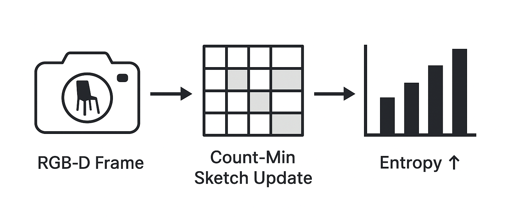
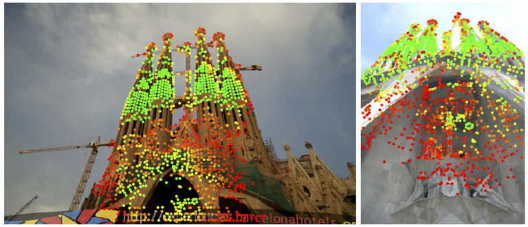

# CowNav

## Background

An important task in robot navigation is **instance-image navigation (IIN)** — navigation to an image of a target at an unknown location. However, in real-world robotics tasks the external environment is quite uniform, and many targets share similar visual features; together these factors make IIN challenging.  
One solution is to give the navigation policy *generalized task awareness*—i.e., awareness of the kinds of downstream tasks the robot must eventually perform—so that path planning can include an **information-collection** sub-goal that benefits the final objective.  
We propose **Sketch-Aware Active Viewpoint Selection (SAVS)** to achieve this.

Our SAVS module (see Fig.&nbsp;1) combines frequency-estimation sketches with online path planning so exploration is both lightweight and informative. Each time the robot captures an RGB-D frame we

* extract **LightGlue** feature tokens — LightGlue is a fast, Transformer-style matcher that groups local descriptors into `tokens` for cross-frame correspondence — and  
* hash their indices into a tiny *Count-Min Sketch* (8 kB in this work).

A Count-Min Sketch records approximate item frequencies in fixed-size integer arrays, so it fits on modest embedded processors (e.g., a drone autopilot).  
For every candidate next pose produced by the motion planner, we estimate the expected increase in sketch entropy (how many sketch buckets are still untouched) and rank poses by this information gain.  
The result is a real-time heuristic that automatically balances **novelty** (new geometry/texture) against existing path constraints (safety, efficiency) without any hand-tuned weights.

  
*Figure 1 — Proposed approach workflow.*

To quantify how “good” an accumulated view set is, we propose **projected matching accuracy**: if canonical goal images of every target are rendered from several compass directions, how many would LightGlue correctly match to the corresponding object in the robot’s current view map?  
Because evaluating every subset of viewpoints is combinatorial, we approximate this with the Count-Min Sketch: larger sketch entropy after a candidate move implies more unseen appearance buckets covered and thus higher projected matching accuracy. Crucially, this surrogate is differentiable with respect to sketch counts and costs only *O(1)* per update, so it is suitable both as a planning heuristic *and* as a training reward.

Empirically, trajectories that score high under our sketch-based metric consistently yield higher final matching scores than those ranked low, validating the approach. This correlation lets us treat sketch entropy as a reliable training signal: reinforcement-learning or imitation-learning agents can optimize it online and generalize easily to other matchers.  
While we focus on **LightGlue** here, the same principle applies to alternatives such as DFF; our algorithm is purposely plug-and-play with your preferred matching mechanism.

  
*Figure 2 — Feature matching from LightGlue (Lindenberger *et al.* 2023).  
This work is currently based on LightGlue, but the interface is fully plug-and-play for other feature-matching methods.*

## Methodology

Our goal is to quantify how well a robot can **pre-collect** image observations that later support instance-image navigation (IIN).  
The pipeline  

1. **generates** generic exploration paths in a 3-D scene,  
2. **records** RGB observations along those paths,  
3. **compresses** the stream of local visual descriptors with a sub-linear sketch, and  
4. **evaluates** how informative the resulting view set is by matching it against unseen goal images.  

Algorithm 1 shows pseudocode for the core entropy computation.

### Simulator&nbsp;and&nbsp;Sensor&nbsp;Configuration

All experiments run in **Habitat-Sim** [@habitat19iccv; @szot2021habitat; @puig2023habitat3] with three public scenes: ``apartment_1``, ``skokloster-castle``, and ``van-gogh-room`` (see Fig.&nbsp;1).  
We load each `.glb` mesh at test time and create a single agent whose RGB camera is mounted at a fixed eye-height of 1.5&nbsp;m.  
Images are rendered at **512 × 512** resolution with a 60 ° horizontal FOV.  
Physics is disabled.

### View Collection

The script ``collect_views.py`` iterates over all poses, saves the raw simulator observations, and compresses them into a single `.npz` archive per scene (~40 MB each).  
Only RGB is stored; depth is unnecessary for the descriptor sketch described below.

### Local-Descriptor Sketch <a name="sec:sketch"></a>

We approximate the entropy of the visual stream with a **Count-Min Sketch (CMS)**.  
For every frame we extract up to 2 048 keypoints using **LightGlue** [@lindenberger2023lightgluelocalfeaturematching], then project each 256-D descriptor **d** with a fixed 256 × 64 random {−1, 1} matrix and binarize to obtain a 64-bit LSH token *h(d)*.  
Tokens are inserted into a CMS of width 16 384 and depth 4; the *i*th row has a unique 32-bit salt.  
After *t* frames the empirical information content is

$$
H_t = -\sum_{j=1}^{W} \hat{p}_j \log_2 \hat{p}_j , \qquad 
\hat{p}_j = \frac{\min_k C_{k,j}}
                 {\sum_u \min_k C_{k,u}},
$$

where \(C_{k,j}\) is the count in row *k*, column *j*.  
Because CMS over-estimates individual counts, taking the column-wise minimum yields a lower bound and guarantees \(H_t\) is non-decreasing.

**Why Count-Min entropy?**  
We need an information measure that  

* increases monotonically as truly new content is discovered,  
* uses constant memory regardless of path length, and  
* updates in real time on edge hardware.  

The Count-Min Sketch satisfies all three: (i) column minima ensure monotonicity, (ii) the \((D\times W)\) array is a fixed 256 kB here, and (iii) each update is \(O(D)\) and takes <1 ms on a modern CPU.  
Alternatives such as mutual information over deep features or kernel density estimates either grow with data size or are too slow for closed-loop use.

### Information Density Metric

To assess how useful recorded views are for IIN we adopt a one-to-many matching protocol similar to **GaussNav** (our integration target).  

* For each scene we sample **five** random goal views (Algorithm 2).  
* We call ``compute_image_pair_similarity`` between the goal view and every frame of a candidate trajectory.  
  The function extracts **DISK** features [@disk], matches them with LightGlue, and returns the number of inlier correspondences.  

For a trajectory *T* and goal *g* we record  

\[
s(g, T) = \max_{i\in T} \text{matches}\bigl(g, I_i\bigr).
\]

The experiment ``compute_match_scores()`` reports the mean and standard deviation of *s* over the five random goals.

### Experimental Protocol

**Sketch Entropy Study.**  
Running ``experiments.py 1`` builds one sketch per *(scene, trajectory)* pair using a random subsample of exactly 30 frames to standardize path length.  
We log the entropy growth curve \(\{H_t\}_{t=1}^{30}\) and the final value \(H_{30}\) (Section Results 1).  
Figure 2 visualizes the curves as a heat map.

**Matching Study.**  
Running ``experiments.py 2`` produces a 3 × 5 table of mean and standard-deviation scores \(\bar{s}, \sigma_s\) (Section Results 2).  
We correlate \(H_{30}\) with \(\bar{s}\) to test whether information density predicts downstream matching success (Fig.&nbsp;3).

### Algorithm&nbsp;1 — Information sketch update
```pseudo
Input : RGB image I_t, sketch (C, salts)
Output: Updated sketch, entropy H_t

D ← SuperPoint(I_t)
for d in D do
    h ← LSH(d)
    for k = 1 … D do
        j ← ((h XOR salts[k]) * 0x9e3779b1) mod W
        C[k, j] ← C[k, j] + 1
    end
end
Compute H_t via the entropy formula above
````

### Algorithm 2 — Goal view sampling

```pseudo
Input : simulator sim, attempts A ← 50
Output: observation dict obs

for a = 1 … A do
    p ← nav.get_random_navigable_point()
    θ ← Uniform(0, 2π)
    set_agent_pose(p, θ)
    obs ← sim.get_sensor_observations()
    if std(obs[rgb]) > 5 then
        return obs
    end
end
return error
```

### Implementation Details

Please refer to our code-base README (linked at the end of this paper) for full installation and version specifics.

### Planned Experimentation

The current study evaluates information collection **offline**.
Ongoing work embeds the same sketch into the **GaussNav** planner \[@lei2025gaussnavgaussiansplattingvisual] and fine-tunes the GaussNav policy.
**Truthfully, time constraints prevented us from evaluating this fine-tuned policy, so we submit the work as-is.**

## Installation & Setup

### Setup (Habitat Sim)

Make a Matterhorn account, and request dataset access. 

Then run ```python -m habitat_sim.utils.datasets_download --username <api-token-id> --password <api-token-secret> --uids hm3d_minival_v0.2```

Downloads as “hm3d”, will need to rename to hm3d_v0.2

Move to GaussianNavigation/data/scene_datasets

Will also want to download the following:

```python -m habitat_sim.utils.datasets_download --uids habitat_test_scenes --data-path data```

```python -m habitat_sim.utils.datasets_download --uids habitat_example_objects --data-path data```

```python examples/example.py --scene data/scene_datasets/habitat-test-scenes/skokloster-castle.glb```

(This last is to verify habitat-sim installed correctly.)

### Setup (Habitat Lab)

```cd GaussianNavigation/3rdparty/habitat-lab-0.2.3``` \
```pip install -e habitat-lab```

```export PATH=/usr/local/cuda/bin:$PATH``` \
```export LD_LIBRARY_PATH=/usr/local/cuda/lib64:$LD_LIBRARY_PATH```

```pip install torch torchvision torchaudio``` \
```--index-url https://download.pytorch.org/whl/cu121```

```pip install meson-python``` \
```pip install --no-build-isolation -r requirements.txt```

Then download data from: https://github.com/facebookresearch/habitat-lab/blob/main/DATASETS.md

```mkdir LightGlue``` \
```cd LightGlue``` \
```python -m pip install git+https://github.com/cvg/LightGlue.git``` 

```pip install natsort```

```cd GaussianNavigation``` \
```python run.py```

### Setup (CowNav)

```pip install -r requirements.txt```

# Run Instructions

Create trajectories with ```python collect_view.py```

Run ```python experiments.py <flag>```, where flag denotes the experiment type

## Acknowledgments 

Thank you to the GaussNav authors, find their work here:

```
@misc{lei2024gaussnavgaussiansplattingvisual,
      title={GaussNav: Gaussian Splatting for Visual Navigation}, 
      author={Xiaohan Lei and Min Wang and Wengang Zhou and Houqiang Li},
      year={2024},
      eprint={2403.11625},
      archivePrefix={arXiv},
      primaryClass={cs.CV},
      url={https://arxiv.org/abs/2403.11625}, 
}
```

Thank you also to all those who built the infrastructure cited in our work, in particular habitat sim and habitat lab! All are cited in our paper.
